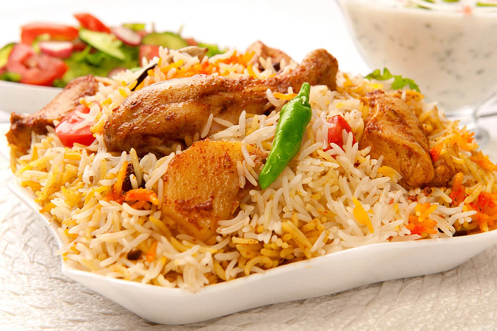

###### DURGA RAMDAS RAJA

My Favorite Food to Eat is Chicken Biriyani because it has all indian spices in it and i like the biriyani flavour more.

---

### RESTAURANTS THAT I RECOMMAND
| **RESTAURANT NAME** | **REASON** | **LOCATION** |
| --------------- | ------ | -------- |
| PARADISE        | I LIKE THE BIRIYANI IN PARADISE BECAUSE THE BIRIYANI IN PARADISE HAS MORE BIRIYANI FLAVOUR RATHER THAN SPICES | HYDERABAD |
| RR DARBAR | I LIKE THE BIRIYANI HERE BECAUSE THE BIRIYANI HAS MORE SPICES | VIJAYAWADA |
| RAJU GARI BIRIYANI | HERE WE HAVE WIDE RANGE OF BIRIYANI'S LIKE AVAKAYA BIRIYANI AND ULAWA CHARU BIRIYANI | VIJAYAWADA |
| ARABIAN MANDEEZ | HERE THE BIRIYANI IS IN ARABIAN STYLE | VIJAYAWADA |

